
<h1 align="center">研究生调研管理系统</h1>

## 简介
研究生调研管理系统：角色分为管理员和用户；论坛管理、教师信息管理、课程和公告信息管理、用户和专业信息管理、问卷管理及调研管理，支持问卷设计与统计分析。    --计算机毕业设计源码；毕设源码；java毕业设计源码

## 联系方式

<h3 align="center">获取完整代码与数据库文件 + 微信：deepguan QQ: 86050149 QQ群: 783742310</h3>

<h3 align="center">可帮忙远程部署 包运行成功！提供远程部署、修改代码、设计文档指导、代码讲解等服务！</h3>

## 功能介绍（完整见运行截图）
管理员：基本功能包括用户登录、注册和退出。管理系统提供多个功能模块，如问卷调查、论坛管理、教师信息管理、课程表信息管理、公告信息管理、用户管理、专业信息管理、问题管理及调研管理。管理员可以在各模块间切换，实现对调研项目的信息管理，如查看详情、修改和删除；支持调研问卷的问题编辑、题目类型设置、选项设置及排序。同时提供数据分析功能，包括选项统计的可视化展示、数据的编辑和删除等，高效进行调研项目的管理与分析。
研究生用户：基于其角色，该系统界面设计活泼，包含多功能模块访问接口。研究生用户可以通过首页导航访问不同模块，实现对感兴趣信息的查询与互动，如教师与课程信息、论坛交流、公告浏览等。在调研问卷参与中，用户可以查看问卷内容、参与答题并查看答题进度与剩余时间，系统引导用户通过“上一题”与“下一题”按钮流畅进行问卷答题流程。用户个人中心提供个人信息查看与修改功能，帮助用户进行个人信息的管理与维护。

## 运行截图
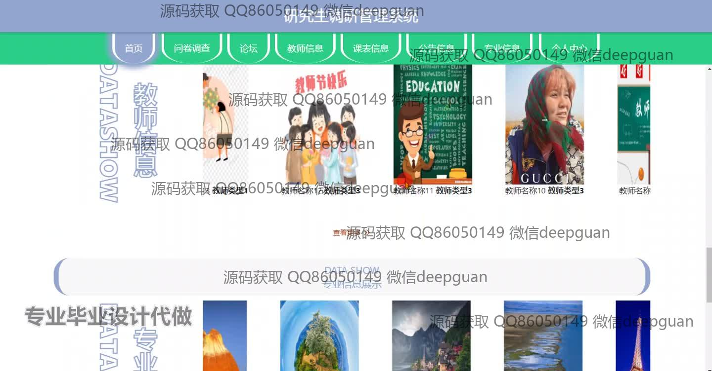
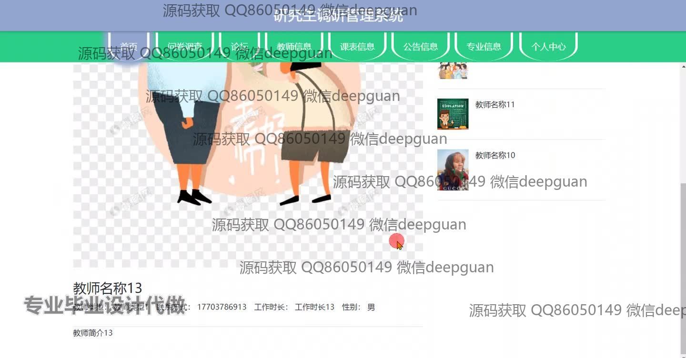
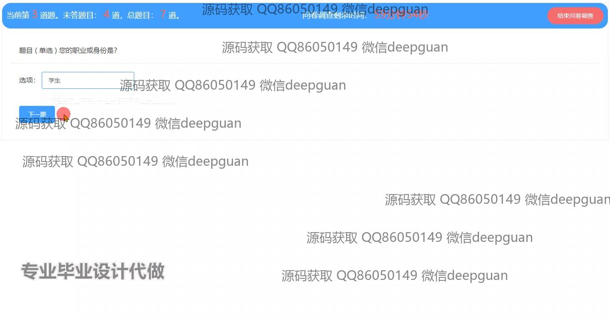
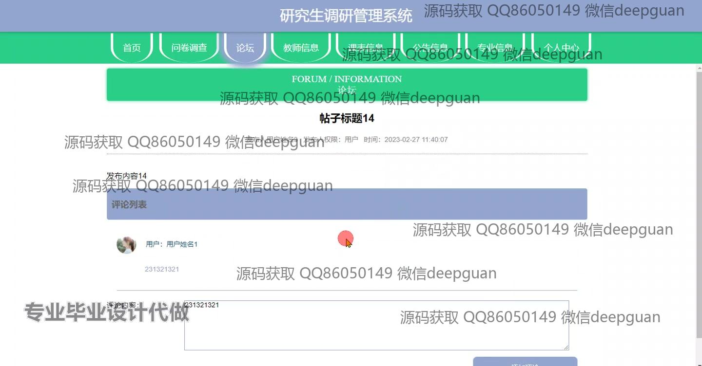
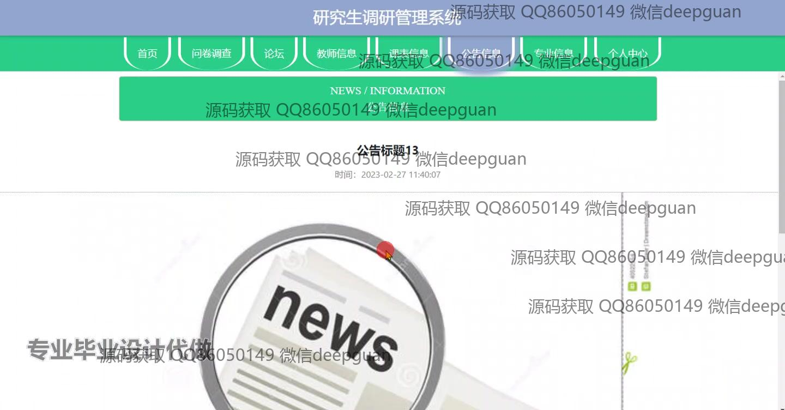
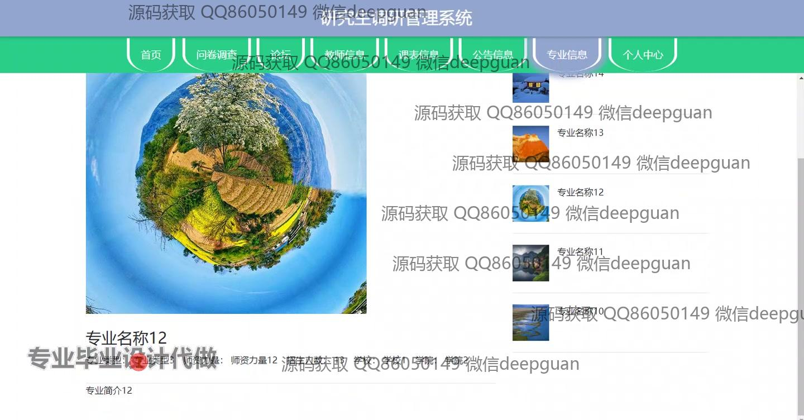
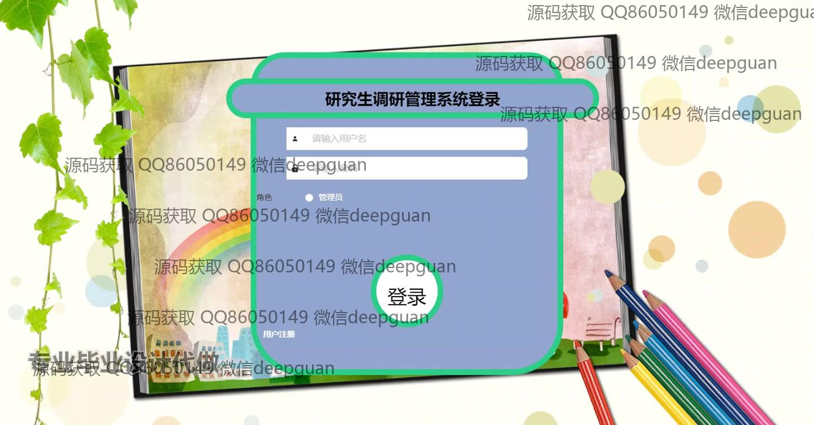

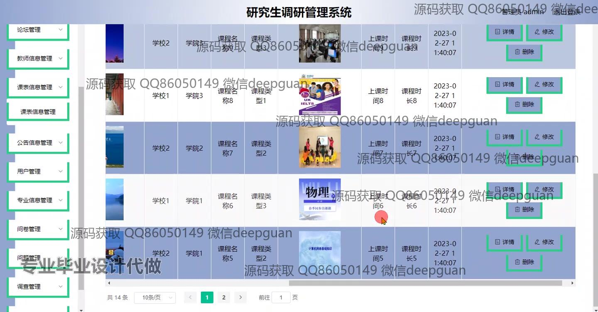
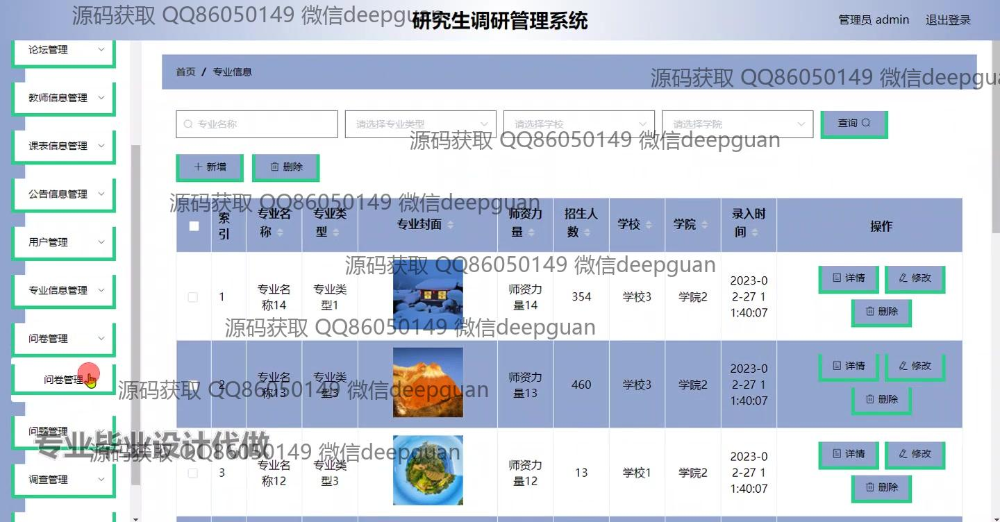
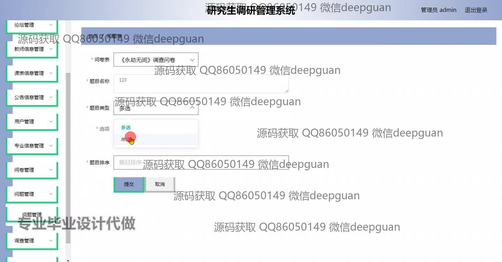
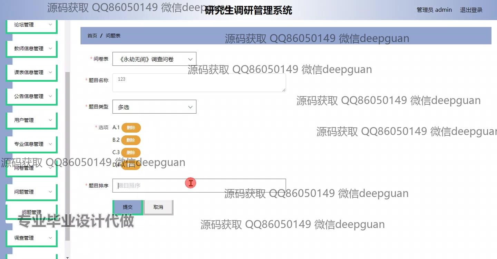
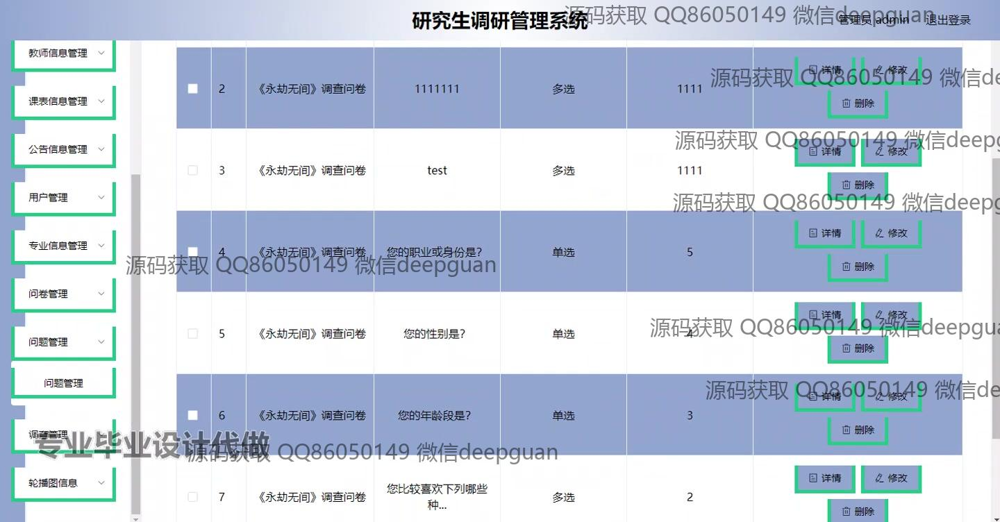
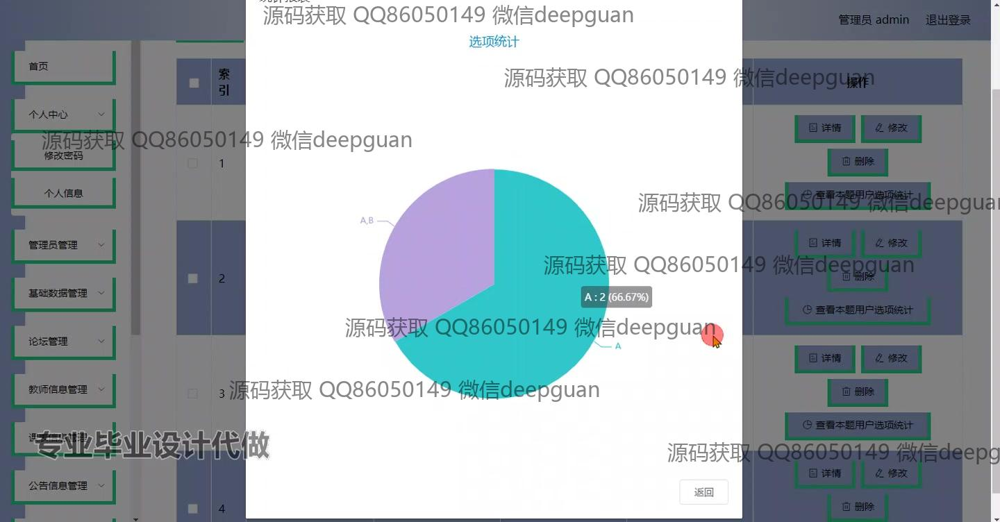
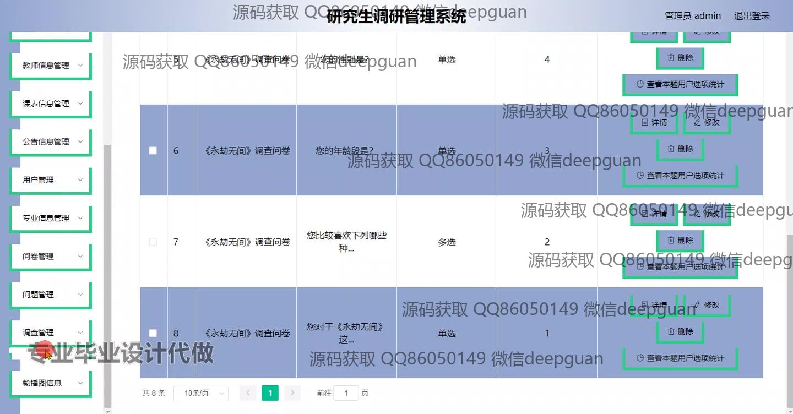

本代码来源于网络,仅供学习参考使用!

